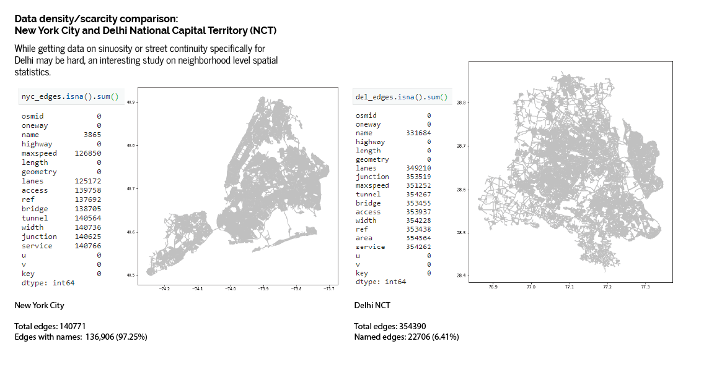
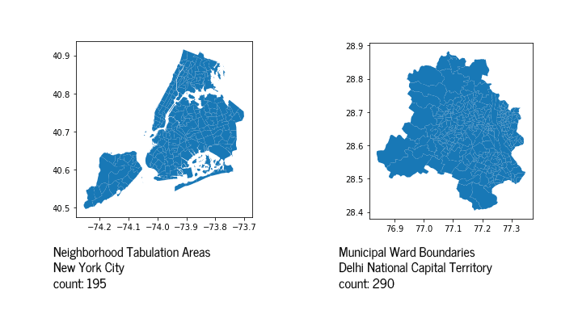

**Delhi RadRoads**

_a. Circuity_:

I got the bearings for every edge. I am unsure how to interpret that.

Assuming 0 = North, 90 = East, 180 = South, 270 = West, the bearing values aren't making sense to me.

 
_b. Sinuosity:_

I went through the radroads.py file, and understood that sinuosity is being calculated as the ratio of street total length, and the gc distance between its two extreme points. I believe this is taken from the Sinuosity index for rivers:  


I was able to get this calculation for all named roads. The main issue is figuring out the order in which the edges join to each other. Each edge has a 'from' and 'to' corresponding to the start and end node OSMID. However in the dataset they're all jumbled up. Plus, bidirectional roads have two parallel lines which seem to be causing some issues with this dimension.

## Lack of Data

We have observed certain difficulties in completely applying the RadRoads code to our selected Indian cities. This is due to data not being as complete as it would've been desired. To compare the edges data between New Delhi and New York, we see a large data scarcity for Delhi, when it comes to road names.



## Neighborhood Level Spatial Statistics:

What we do have common between both datasets is edge and node data, as well as neighborhood level polygon data. Using the [```osmnx_stats``` module](https://osmnx.readthedocs.io/en/stable/osmnx.html#module-osmnx.stats) at a city-wide as well as neighborhood-level scale, can we derive any interesting insights in how these two distinct cities function?

### Deciding what level to subdivide the city:
 New York City is divided into 5 boroughs, and the NCT of Delhi is similarly divided into 4 municipal corporations and 1 cantonment board administration. As such, we can consider using these divisions to carry out initial spatial statistics.
 
### A finer level of division
 
A secondary subdivision can be done at municipal subdivision levels.

**[Neighborhood Tabulation Areas](https://www1.nyc.gov/site/planning/data-maps/open-data/dwn-nynta.page#:~:text=Archived%20Data%20Sets-,Neighborhood%20Tabulation%20Areas%20(Formerly%20%22Neighborhood%20Projection%20Areas%22),plan%20for%20New%20York%20City.)**

These were created to project population changes in New York City between 2000-2030 at a smaller scale. Their boundaries are aligned on major thoroughfares.

**[Municipal Ward Boundaries](https://github.com/datameet/Municipal_Spatial_Data/tree/master/Delhi)**

These are subdivisions at a muunicipal level created for administrative reasons. Therefore the reasons behind the creation of these ward boundaries are different from that of the NTAs in New York. However, the division level is granular enough for comparison reasons.


